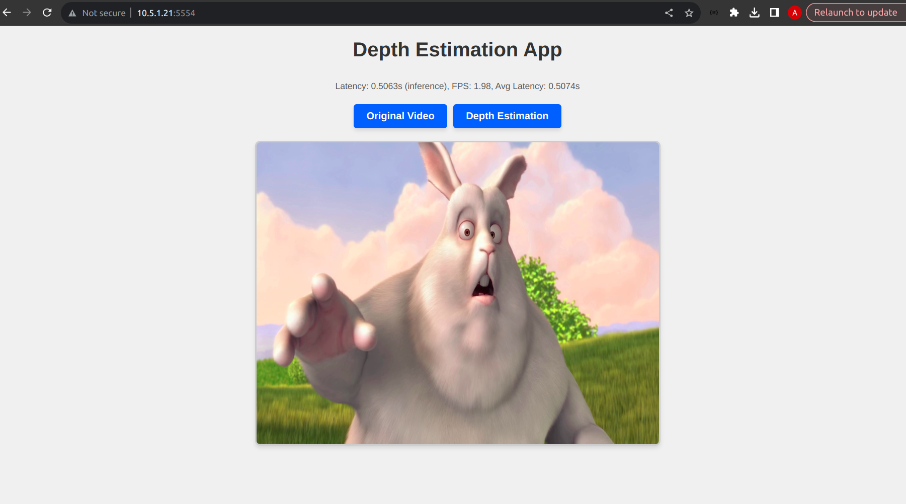
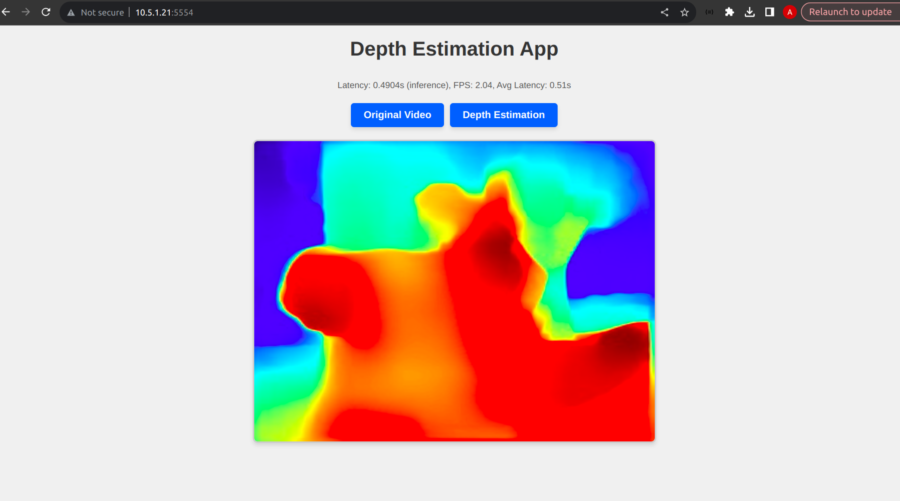

# DESIRE6G - Monocular Depth Estimation App

Real-time monocular depth estimation via Flask web UI

Supports either live webcam or looped test-video playback, with two inference modes:

- *default*: Keras model from [Hugging Face](https://huggingface.co/keras-io/monocular-depth-estimation)
- *deploy*: SOL-optimized version of the Keras model

## Setup

1. Extract and assemble SOL-optimized model files and required native libraries:

   ```bash
   cd app/models && ./recombine_and_extract.sh && cd ../..
   ```
2. Build Docker image:

   ```bash
   ./build.sh
   ```

## Usage

* **Default (Keras model)**

  ```bash
  ./run_example.sh python3 app.py -m default
  ```
* **Optimized (SOL-optimized model)**

  ```bash
  ./run_example.sh python3 app.py -m deploy
  ```
* **Test mode (looped video, no webcam)**

  ```bash
  ./run_example.sh python3 app.py -m deploy --test
  ```

* **Test mode (looped video, no webcam) with GPU**
  ```bash
  ./run_example_gpu.sh python3 app.py -m deploy --test --gpu
  ```

## Web Interface

Open your browser at [http://10.5.1.21:5554/](http://10.5.1.21:5554/) to view live video




