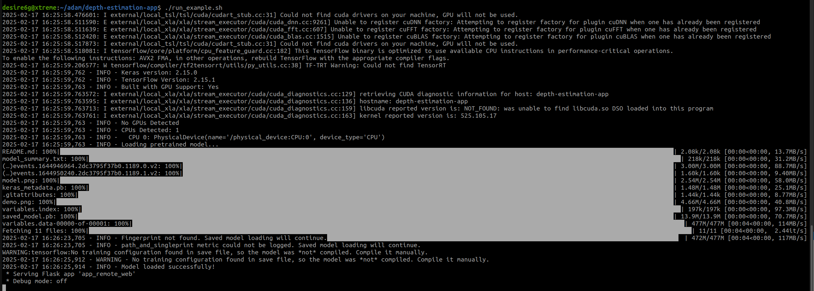
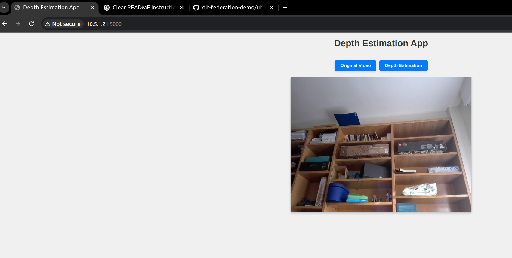
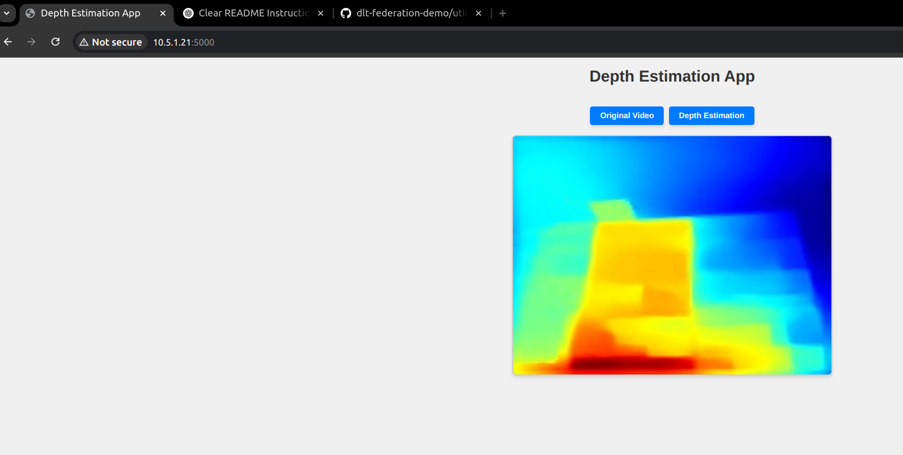

# Depth Estimation App

## On the 5TONIC Server
Start the depth estimation service:

```bash
./run_example.sh
```



## On Your Machine
Send video frames to the 5TONIC server:

```bash
./video_sender.sh --server_url http://10.5.1.21:5000/upload_frame
```

View the depth-estimated images here: [http://10.5.1.21:5000/](http://10.5.1.21:5000/)

Ensure:
- The server is running.
- Docker is installed and the [video-sender](./docker-images/video-sender) image is built.



