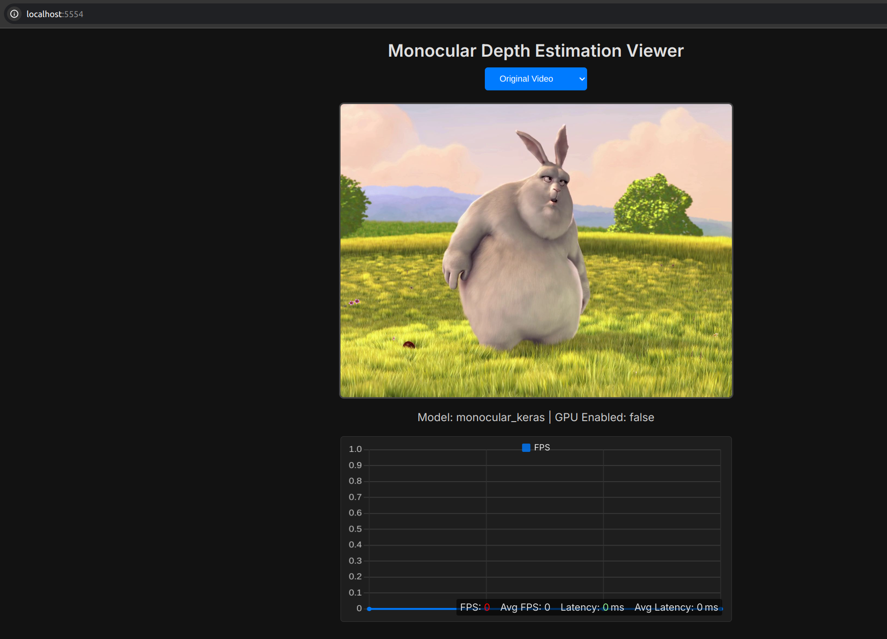
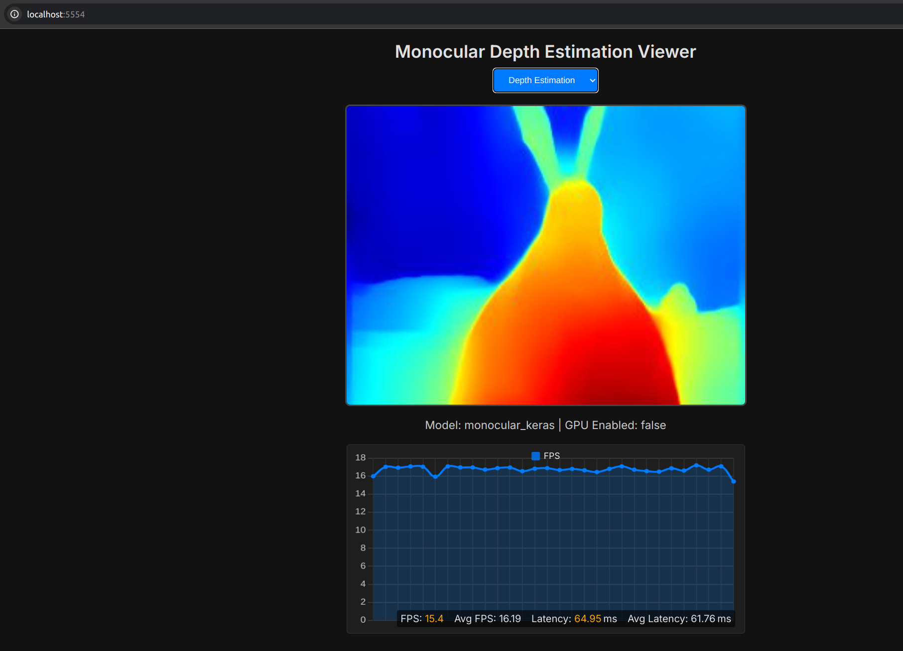

# DESIRE6G - Monocular Depth Estimation App

Real-time monocular depth estimation via Flask web UI

Supports either live webcam or looped test-video playback, with two inference modes:

- *default*: Keras model from [Hugging Face](https://huggingface.co/keras-io/monocular-depth-estimation)
- *deploy*: SOL-optimized version of the Keras model

## Setup

1. Extract and assemble SOL-optimized model files and required native libraries:

   ```bash
   cd app/models && ./recombine_and_extract.sh && cd ../..
   ```
2. Build Docker image:

   ```bash
   ./build.sh
   ```

## Usage

* **Default (Keras model)**

  ```bash
  ./run_example.sh python3 app.py -m default
  ```
* **Optimized (SOL-optimized model)**

  ```bash
  ./run_example.sh python3 app.py -m deploy
  ```
* **Test mode (looped video, no webcam)**

  ```bash
  ./run_example.sh python3 app.py -m deploy --test
  ```

* **Test mode (looped video, no webcam) with GPU**
  ```bash
  ./run_example_gpu.sh python3 app.py -m deploy --test --gpu
  ```


### Error in app_old.py
```
desire6g@xtreme:~/adam/depth-estimation-app$ ./run_example_gpu.sh python3 app.py -m deploy --test --gpu

==========
== CUDA ==
==========

CUDA Version 12.0.0

Container image Copyright (c) 2016-2023, NVIDIA CORPORATION & AFFILIATES. All rights reserved.

This container image and its contents are governed by the NVIDIA Deep Learning Container License.
By pulling and using the container, you accept the terms and conditions of this license:
https://developer.nvidia.com/ngc/nvidia-deep-learning-container-license

A copy of this license is made available in this container at /NGC-DL-CONTAINER-LICENSE for your convenience.

*************************
** DEPRECATION NOTICE! **
*************************
THIS IMAGE IS DEPRECATED and is scheduled for DELETION.
    https://gitlab.com/nvidia/container-images/cuda/blob/master/doc/support-policy.md

2025-06-10 10:42:08.905357: E external/local_xla/xla/stream_executor/cuda/cuda_dnn.cc:9261] Unable to register cuDNN factory: Attempting to register factory for plugin cuDNN when one has already been registered
2025-06-10 10:42:08.905404: E external/local_xla/xla/stream_executor/cuda/cuda_fft.cc:607] Unable to register cuFFT factory: Attempting to register factory for plugin cuFFT when one has already been registered
2025-06-10 10:42:08.906186: E external/local_xla/xla/stream_executor/cuda/cuda_blas.cc:1515] Unable to register cuBLAS factory: Attempting to register factory for plugin cuBLAS when one has already been registered
2025-06-10 10:42:08.911484: I tensorflow/core/platform/cpu_feature_guard.cc:182] This TensorFlow binary is optimized to use available CPU instructions in performance-critical operations.
To enable the following instructions: AVX2 FMA, in other operations, rebuild TensorFlow with the appropriate compiler flags.
2025-06-10 10:42:09.622595: W tensorflow/compiler/tf2tensorrt/utils/py_utils.cc:38] TF-TRT Warning: Could not find TensorRT
2025-06-10 10:42:10,149 - INFO - Selected mode: deploy
2025-06-10 10:42:10,149 - INFO - Test mode: enabled
2025-06-10 10:42:10,149 - INFO - Keras version: 2.15.0
2025-06-10 10:42:10,149 - INFO - TensorFlow version: 2.15.1
2025-06-10 10:42:10,149 - INFO - Built with GPU support: Yes
2025-06-10 10:42:10.185347: I external/local_xla/xla/stream_executor/cuda/cuda_executor.cc:901] successful NUMA node read from SysFS had negative value (-1), but there must be at least one NUMA node, so returning NUMA node zero. See more at https://github.com/torvalds/linux/blob/v6.0/Documentation/ABI/testing/sysfs-bus-pci#L344-L355
2025-06-10 10:42:10.211306: I external/local_xla/xla/stream_executor/cuda/cuda_executor.cc:901] successful NUMA node read from SysFS had negative value (-1), but there must be at least one NUMA node, so returning NUMA node zero. See more at https://github.com/torvalds/linux/blob/v6.0/Documentation/ABI/testing/sysfs-bus-pci#L344-L355
2025-06-10 10:42:10.211547: I external/local_xla/xla/stream_executor/cuda/cuda_executor.cc:901] successful NUMA node read from SysFS had negative value (-1), but there must be at least one NUMA node, so returning NUMA node zero. See more at https://github.com/torvalds/linux/blob/v6.0/Documentation/ABI/testing/sysfs-bus-pci#L344-L355
GPUs Detected: 1
  GPU 0: PhysicalDevice(name='/physical_device:GPU:0', device_type='GPU')
2025-06-10 10:42:10,211 - INFO - Initializing SOL-optimized model from: monocular_deployed_gpu
2025-06-10 10:42:11,495 - INFO - Deployed model initialized successfully!
2025-06-10 10:42:11,495 - INFO - Opening test video: /app/videos/test-video.mp4
2025-06-10 10:42:11,528 - INFO - Starting video stream
 * Serving Flask app 'app'
 * Debug mode: off
Module: SOL/backend_nvidia
File: /usr/local/lib/python3.10/dist-packages/sol/include/sol/nvidia/dp_api_offload.h
Line: 156
Message123: CUDA_ERROR_INVALID_CONTEXT: invalid device context
Done.
```

## Web Interface

Open your browser at [http://10.5.1.21:5554/](http://10.5.1.21:5554/) to view live video




